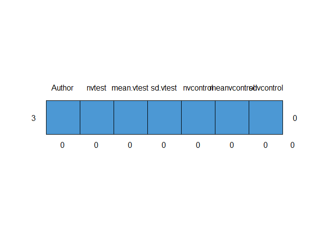
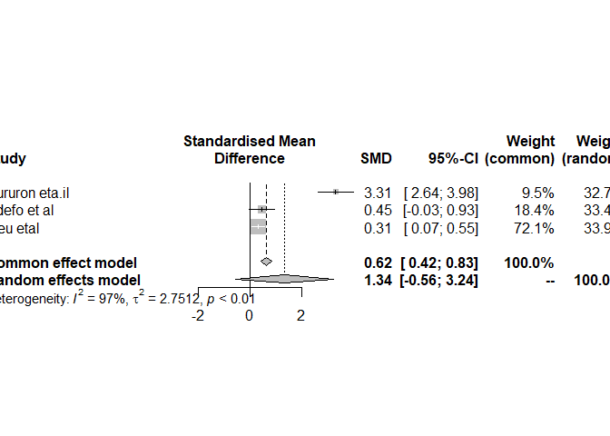
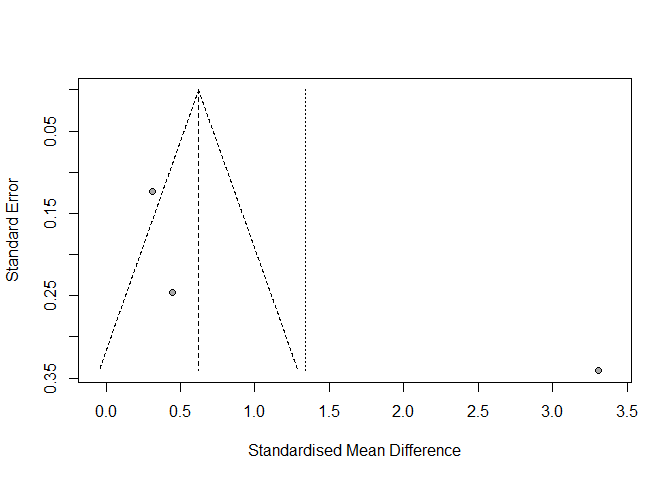

Meta analysis
================
Joshua Edefo
2024-01-16

Libraries

``` r
library(meta)
```

    ## Warning: package 'meta' was built under R version 4.3.2

``` r
library(readxl)
library(mice)
```

    ## Warning: package 'mice' was built under R version 4.3.2

## R Markdown

Upload data and data cleansing

``` r
metasamples <- read_excel("C:/Users/joe62/OneDrive - Aberystwyth University/Apps/Desktop/metasamples.xlsx")
View(metasamples)
head(metasamples)
```

    ## # A tibble: 3 × 7
    ##   Author         nvtest mean.vtest sd.vtest nvcontrol meanvcontrol sdvcontrol
    ##   <chr>           <dbl>      <dbl>    <dbl>     <dbl>        <dbl>      <dbl>
    ## 1 Gururon eta.il     89        7.3      0.3        19          6.3        0.3
    ## 2 Edefo et al        49        6.7      3.5        26          5.2        2.9
    ## 3 Lieu etal         245        4.6      3.5        90          3.5        3.6

``` r
str(metasamples)
```

    ## tibble [3 × 7] (S3: tbl_df/tbl/data.frame)
    ##  $ Author      : chr [1:3] "Gururon eta.il" "Edefo et al" "Lieu etal"
    ##  $ nvtest      : num [1:3] 89 49 245
    ##  $ mean.vtest  : num [1:3] 7.3 6.7 4.6
    ##  $ sd.vtest    : num [1:3] 0.3 3.5 3.5
    ##  $ nvcontrol   : num [1:3] 19 26 90
    ##  $ meanvcontrol: num [1:3] 6.3 5.2 3.5
    ##  $ sdvcontrol  : num [1:3] 0.3 2.9 3.6

``` r
md.pattern(metasamples)
```

    ##  /\     /\
    ## {  `---'  }
    ## {  O   O  }
    ## ==>  V <==  No need for mice. This data set is completely observed.
    ##  \  \|/  /
    ##   `-----'

<!-- -->

    ##   Author nvtest mean.vtest sd.vtest nvcontrol meanvcontrol sdvcontrol  
    ## 3      1      1          1        1         1            1          1 0
    ##        0      0          0        0         0            0          0 0

``` r
# in case of deleting observation with NA
metasamples<-(na.omit(metasamples))
```

## Including Plots

Analysis

``` r
head(metasamples)
```

    ## # A tibble: 3 × 7
    ##   Author         nvtest mean.vtest sd.vtest nvcontrol meanvcontrol sdvcontrol
    ##   <chr>           <dbl>      <dbl>    <dbl>     <dbl>        <dbl>      <dbl>
    ## 1 Gururon eta.il     89        7.3      0.3        19          6.3        0.3
    ## 2 Edefo et al        49        6.7      3.5        26          5.2        2.9
    ## 3 Lieu etal         245        4.6      3.5        90          3.5        3.6

``` r
metademo<-metacont(nvtest, mean.vtest, sd.vtest, nvcontrol, meanvcontrol, sdvcontrol, 
                   fixed = T, random= T, studlab = Author , data = metasamples, sm = "SMD")
metademo
```

    ## Number of studies: k = 3
    ## Number of observations: o = 518
    ## 
    ##                         SMD            95%-CI    z  p-value
    ## Common effect model  0.6215 [ 0.4153; 0.8277] 5.91 < 0.0001
    ## Random effects model 1.3382 [-0.5603; 3.2366] 1.38   0.1671
    ## 
    ## Quantifying heterogeneity:
    ##  tau^2 = 2.7512 [0.6881; >100.0000]; tau = 1.6587 [0.8295; >10.0000]
    ##  I^2 = 97.1% [94.2%; 98.5%]; H = 5.87 [4.15; 8.30]
    ## 
    ## Test of heterogeneity:
    ##      Q d.f.  p-value
    ##  68.85    2 < 0.0001
    ## 
    ## Details on meta-analytical method:
    ## - Inverse variance method
    ## - Restricted maximum-likelihood estimator for tau^2
    ## - Q-Profile method for confidence interval of tau^2 and tau
    ## - Hedges' g (bias corrected standardised mean difference; using exact formulae)

Plots and its interpretations

``` r
# plot forest plot
forest(metademo,leftcols = c("studlab"))
```

<!-- -->

``` r
# heterogeneity <50% use common effect model, > 50% use Random effect model
# here the heterogeneity is observed 975 hence random effect model will be followed, from the forest plot, interpretation can be made that 
#intervention shows a 1.34 degrees reduction in VAS scores compared to control group. 
#However as the effect size is crossing the line of no difference, the results are statistically non-signficant

 # funnel plot
funnel(metademo)
```

<!-- -->
Session informatiom

``` r
sessionInfo()
```

    ## R version 4.3.1 (2023-06-16 ucrt)
    ## Platform: x86_64-w64-mingw32/x64 (64-bit)
    ## Running under: Windows 11 x64 (build 22631)
    ## 
    ## Matrix products: default
    ## 
    ## 
    ## locale:
    ## [1] LC_COLLATE=English_United Kingdom.utf8 
    ## [2] LC_CTYPE=English_United Kingdom.utf8   
    ## [3] LC_MONETARY=English_United Kingdom.utf8
    ## [4] LC_NUMERIC=C                           
    ## [5] LC_TIME=English_United Kingdom.utf8    
    ## 
    ## time zone: Europe/London
    ## tzcode source: internal
    ## 
    ## attached base packages:
    ## [1] stats     graphics  grDevices utils     datasets  methods   base     
    ## 
    ## other attached packages:
    ## [1] mice_3.16.0  readxl_1.4.3 meta_6.5-0  
    ## 
    ## loaded via a namespace (and not attached):
    ##  [1] utf8_1.2.3          generics_0.1.3      tidyr_1.3.0        
    ##  [4] xml2_1.3.6          shape_1.4.6         lattice_0.21-8     
    ##  [7] mitml_0.4-5         lme4_1.1-35.1       digest_0.6.33      
    ## [10] magrittr_2.0.3      evaluate_0.21       grid_4.3.1         
    ## [13] iterators_1.0.14    CompQuadForm_1.4.3  fastmap_1.1.1      
    ## [16] jomo_2.7-6          cellranger_1.1.0    foreach_1.5.2      
    ## [19] Matrix_1.6-1.1      glmnet_4.1-8        nnet_7.3-19        
    ## [22] backports_1.4.1     survival_3.5-5      purrr_1.0.2        
    ## [25] fansi_1.0.4         codetools_0.2-19    numDeriv_2016.8-1.1
    ## [28] cli_3.6.1           rlang_1.1.1         splines_4.3.1      
    ## [31] yaml_2.3.7          pan_1.9             tools_4.3.1        
    ## [34] nloptr_2.0.3        minqa_1.2.6         metafor_4.4-0      
    ## [37] dplyr_1.1.3         mathjaxr_1.6-0      boot_1.3-28.1      
    ## [40] broom_1.0.5         rpart_4.1.19        vctrs_0.6.3        
    ## [43] R6_2.5.1            lifecycle_1.0.3     MASS_7.3-60        
    ## [46] pkgconfig_2.0.3     pillar_1.9.0        glue_1.6.2         
    ## [49] Rcpp_1.0.11         xfun_0.40           tibble_3.2.1       
    ## [52] tidyselect_1.2.0    rstudioapi_0.15.0   knitr_1.44         
    ## [55] htmltools_0.5.6     nlme_3.1-162        rmarkdown_2.25     
    ## [58] compiler_4.3.1      metadat_1.2-0
